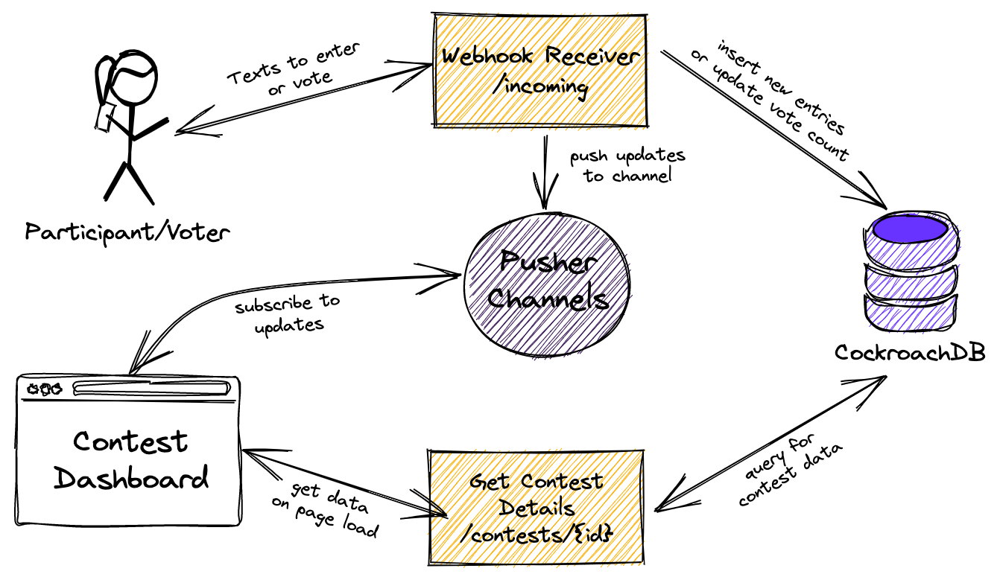

# Ugly Sweater Voting App

## Enter and cast votes for an Ugly Sweater contest using SMS.

This app consists of a Dashboard displaying the status of the contest and a serverless backend that will facilitate bootstrapping the dashboard and handling updates from SMS messages using websockets.

To enter, text a picture with the contest and name to enter.

To cast a vote, text the context and name of the entry.

### Stack

- [Netlify](https://www.netlify.com/) for Serverless Functions and Hosting
- [Next.js](https://nextjs.org/) for Frontend
- [Pusher Channels](https://pusher.com/channels) for Websockets
- [Twilio](https://www.twilio.com/) for inbound/outbound SMS
- [CockroachDB Serverless](https://www.cockroachlabs.com/) for database

### Workflow

### Database Schema

A [script has been provided](./scripts/init_database.sql) to create the following tables.

#### contests

- id - `UUID`
- name - `STRING`
- description - `STRING`
- max_votes - `INT` (Max number of votes per voter)

#### entries

- id - `UUID`
- contest_id - `UUID`
- name - `STRING`
- picture - BYTES (1 MB max)
- picture_type - `STRING`

#### votes

- contest_id - `UUID`
- entry_id - `UUID`
- voter_id - `STRING` (hashed phone number)

## Getting Started

### CockroachDB Serverless Configuration

**TODO** Sign up and Create Cluster, Run script to create database and tables

### Twilio SMS Configuration

**TODO** Sign up and create project. Buy phone number and add Inbound SMS webhook

### Pusher Channels Configuration

**TODO** Sign up and create a project

### Installation options

**Option one:** One-click deploy

Clicking this button will create a new repo for you that looks like this one, and sets that repo up immediately for deployment on Netlify. You will be prompted for a repo name and to provide the values for the following environment variables:

- Postgres Connection String (`DATABASE_URL`), **required** You can find this in the Connect model in the Cockroach Labs Cloud Console
- Twilio Configuration
  - Auth Token (`TWILIO_AUTH_TOKEN`), **required**
  - Phone number (`NEXT_PUBLIC_TWILIO_NUMBER`), **required**
- Pusher Channels Configuration
  - Applicaiton ID (`PUSHER_APP_ID`), **required**
  - Secret (`PUSHER_SECRET`), **required**
  - Key (`NEXT_PUBLIC_PUSHER_KEY`), **required**
  - Cluster (`NEXT_PUBLIC_PUSHER_CLUSTER`), **required**

**Option two:** Manual clone

You will need to [install the Netlify CLI](https://docs.netlify.com/cli/get-started/) and connect it to your Netlify site to run locally.

1. Clone this repo: `git clone https://github.com/aydrian/ugly-sweater-app.git`
2. Navigate to the directory and run `ntl init` to connect to Netlify
3. Add the above environment variables using `ntl env:set [env var] [value]`
4. Run the app locally using `ntl dev`
5. Make any changes and push to your repo to deploy.
